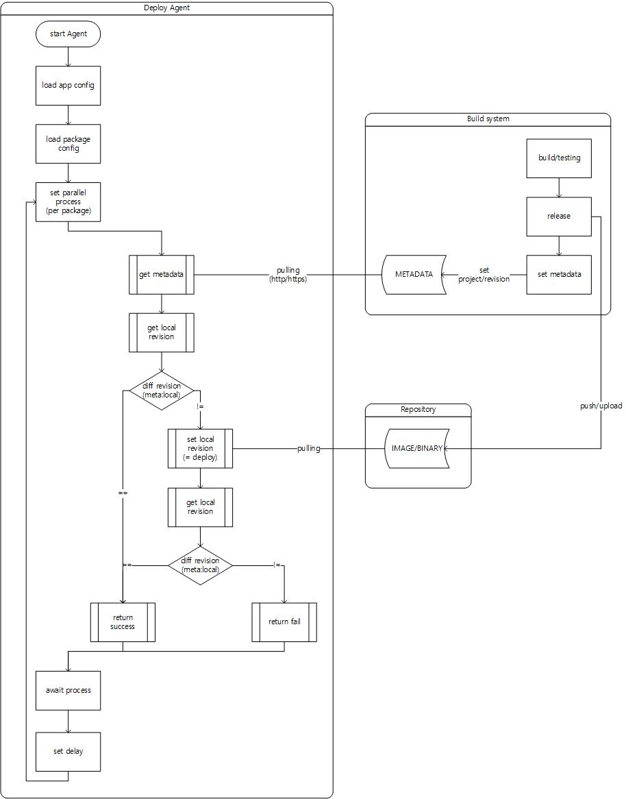

# Deploy Agent
sync local revision to metadata

## configure
- agent env: see `src/config.ts`
- packages: set `packages/*`

## deploy types
- git
  - git reset --hard ${commitHash}
- k8s
  - kubectl set image ... ${image}:{tag}

## flow diagram

